# Deep Learning - Task 1
## Roland Gulbinovič - 2416108

The first task requires
* to create image segmentation model to classify pixels to 3 or more classes.
* calculate accuracy, precision, recovery and F1 statistics for selected classes on unseen 100 images from [OpenImages](https://storage.googleapis.com/openimages/web/index.html)

## Intro
Code was written and ran on Google Collab with free GPU.
The dataset images were stored and read from a mounted Google Drive.

Used Classes:
- Car
- Motorcycle
- Bus

## Dataset

Data used for training and testing:
* Training - 750 images from [OpenImages](https://storage.googleapis.com/openimages/web/index.html)
* Test - 100 images from [OpenImages](https://storage.googleapis.com/openimages/web/index.html)

## Image/Mask pre-processing:

The fiftyOne dataset includes annotations for many objects in each image. 

To prepare masks - I created an empty mask and then only added annotations for the classes that I'm interested in (Car, Motorcycle, Bus).

## Augmentations

- `A.Affine(scale=(0.9, 1.1), translate_percent=(0.05, 0.05), rotate=(-10, 10), p=0.7)`
Applies random scaling, shifting, and rotation to simulate camera movement.

- `A.ColorJitter(brightness=0.3, contrast=0.3, saturation=0.3, hue=0.05, p=0.5)`
Randomly adjusts brightness, contrast, saturation, and hue to simulate lighting variation.

- `A.RandomBrightnessContrast(p=0.5)`
Further varies image brightness and contrast to simulate day/night or shadow changes.

- `A.RandomGamma(p=0.3)`
Modifies image luminance non-linearly to simulate different exposure settings.

- `A.HueSaturationValue(hue_shift_limit=10, sat_shift_limit=15, val_shift_limit=10, p=0.3)`
Randomly shifts hue, saturation, and value for more diverse color conditions.

- `A.GaussNoise(p=0.2)`
Adds Gaussian noise to simulate sensor imperfections or low-light artifacts.

- `A.MotionBlur(blur_limit=3, p=0.1)`
Blurs the image slightly to simulate motion or camera shake.

- `A.CoarseDropout(max_holes=8, max_height=64, max_width=64, p=0.4)`
Randomly drops out square regions to simulate occlusions or missing data.

## Models

All models were trained using these parameters:
- epochs = 30-40
- batch_size = 8
- learning_rate = 1-e04

1. I first created a basic **UNet** model where i wrote the structure manually. This model and the training loop needed modifications, because I noticed the dataset had huge problems with class imbalances. Car was easily the most dominant class, where Motorcycles and Buses were much rarer. This made the model quite bad because even if the shape was predicted correctly - it was always classifying the shape as a Car. To fix this 2 things were added:
    - Dice Loss
    - Calculated class weights

2. Used an already created **UNet** model - `segmentation_models_pytorch.Unet`. This model already has a pre-trained encoder. Since we didn't use a very large dataset for training, we expect having an already pre-trained encoder to help a lot with our segmentation.

## Results

To check the accuracy of the model - I calculated accuracy, precision, recall and F1 statistics. Also took some pictures and visualised the predicted masks.

Here are some truth masks from our test dataset - one for each class. We can see that the car "truth" mask is pretty bad. Not sure if this is because of how I processed the image or if the annotation/mask is incorrectly written for this image. Still, this is a good example because we will be able to see if our models do "better" at segmentation for this image.

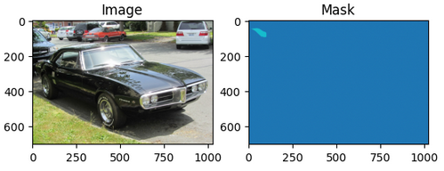

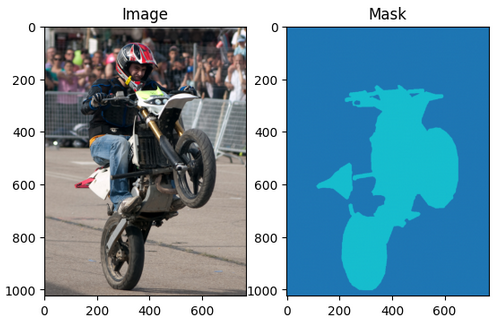

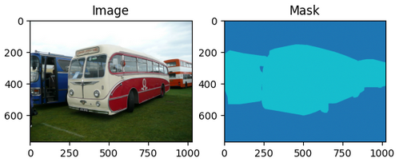

### Manually created UNet model:

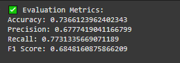

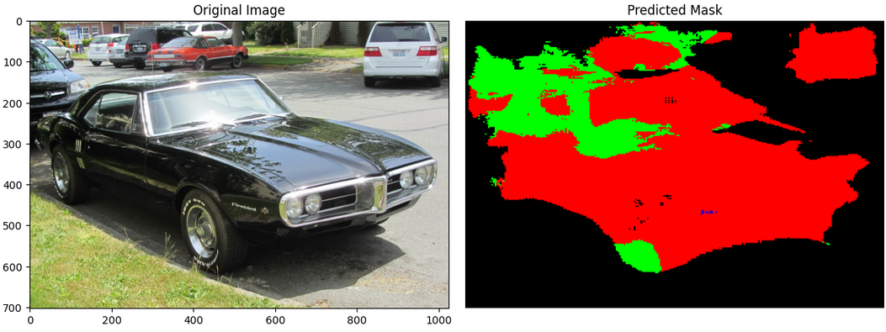

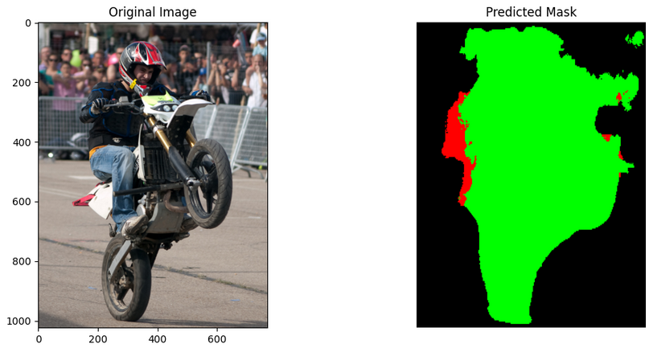

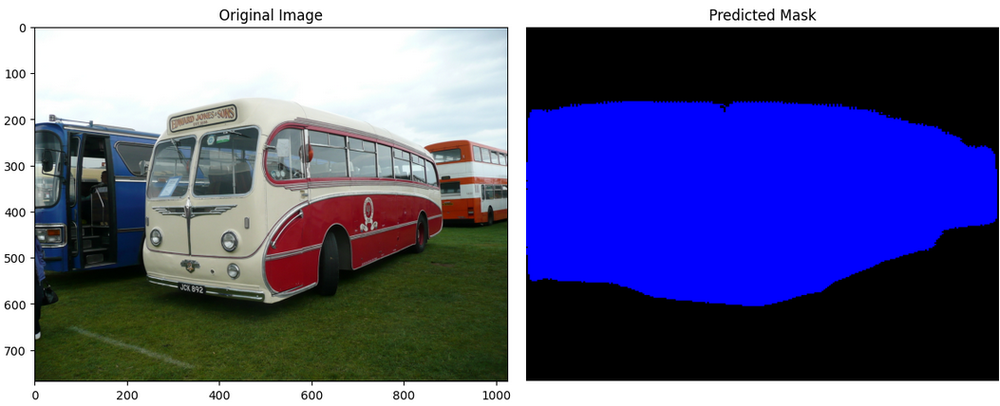

We can see that the shapes of the objects are usually quite well detected. The problem is with the classification of the object. This could be happening because of 2 reasons:
- Class Imbalance - even though I tried to account for the class imbalance using Dice and Class weights, not having enough images for motorcycles and buses still affects the accuracy quite a lot.
- Not enough images in general for training. There are a lot of images in the dataset (a lot of them are wrongly masked which we saw earlier) where there is a whole highway with a lot of cars. Also some images have cars very close to motorcycles and buses. This is probably why we can see multi-colored objects.

### Model with already created structure and pre-trained encoder -  `segmentation_models_pytorch.Unet`:

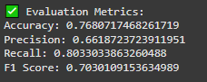

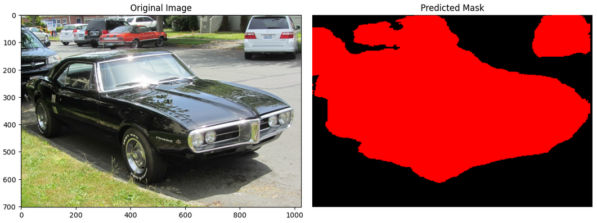

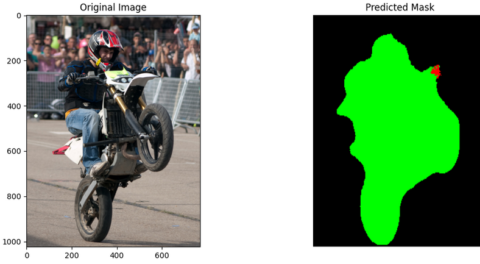

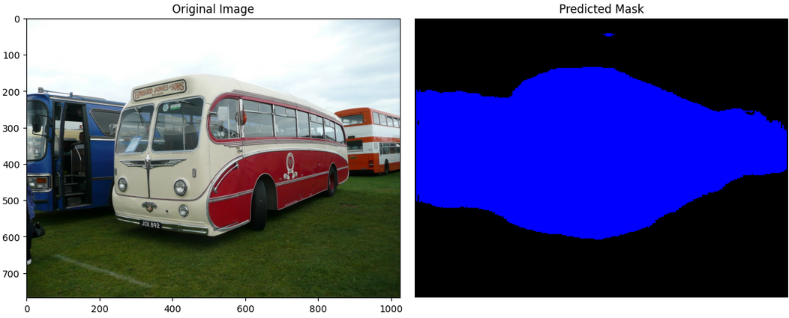

As expected - the overall results are much better using this model. The shapes are a bit cleaner and the classifications are __much__ more accurate. The biggest improvement is that the full object is classified to mostly only one class, where compared to my manually created model - one object had pixels belonging to multiple classes. 
